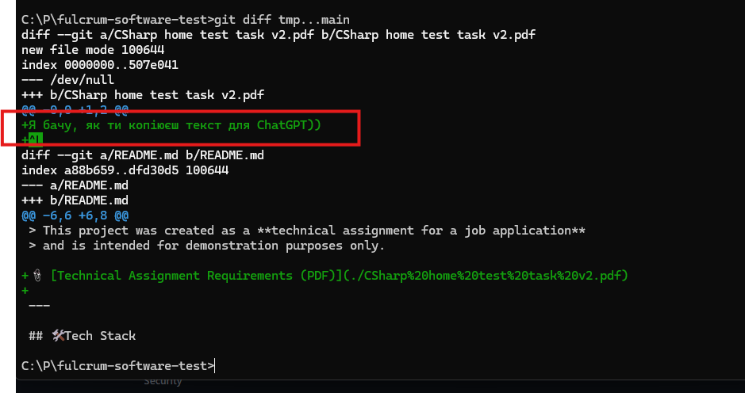

# Fulcrum Software test project by [Oleh Shevtsiv](https://www.linkedin.com/in/olegshevtsiv/)

> [!TIP]
> 🖐️ *This repo inspired by first version: https://github.com/olehserv/oleh-shevtsiv-pet*

## 📌 Overview

> ⚠️ **Disclaimer**  
> This project was created as a **technical assignment for a job application**  
> and is intended for demonstration purposes only.

📎 [Technical Assignment Requirements (PDF)](./CSharp%20home%20test%20task%20v2.pdf)

---

## 🛠 Tech Stack
- opt 1
- opt 2
- opt 3

---

## 🧱 Architecture & Design
- opt 1
- opt 2
- opt 3

## 📂 Project Structure

```text
src/
 ├── <Project>.Assembly1              # Assembly 1
 └── <Project>.Assembly2              # Assembly 2
tests/
 ├── <Project>.UnitTests              # Unit tests
 └── <Project>.IntegrationTests       # Integration tests
```

---

## 📦 Huget packages
| Package | Version | Downloads |
|--------|---------|-----------|
| `Library.File.Core` | [](https://www.nuget.org/packages/olehserv.fulcrum-software-test.Library.File.Core/) | [](https://www.nuget.org/packages/olehserv.fulcrum-software-test.Library.File.Core/) |
| `Library.File.Format.Xml` | [](https://www.nuget.org/packages/olehserv.fulcrum-software-test.Library.File.Format.Xml/) | [](https://www.nuget.org/packages/olehserv.fulcrum-software-test.Library.File.Format.Xml/) |
| `Library.File.Source.Physical` | [](https://www.nuget.org/packages/olehserv.fulcrum-software-test.Library.File.Source.Physical/) | [](https://www.nuget.org/packages/olehserv.fulcrum-software-test.Library.File.Source.Physical/) |
| `Library.Management` | [](https://www.nuget.org/packages/olehserv.fulcrum-software-test.Library.Management/) | [](https://www.nuget.org/packages/olehserv.fulcrum-software-test.Library.Management/) |
| `Library.Models` | [](https://www.nuget.org/packages/olehserv.fulcrum-software-test.Library.Models/) | [](https://www.nuget.org/packages/olehserv.fulcrum-software-test.Library.Models/) |


---

## 🚀 Getting Started

### 🧰 Prerequisites
- opt 1
- opt 2
- opt 3

### 🧪 Testing
```bash
<command to run unit tests>
```

---

## 🤝 Contributing
[**Follow**](./CONTRIBUTING.md) for more details.

---

## 📄 License
This project is licensed under the **MIT License**.  
See the [LICENSE](LICENSE) file for details.

---

> ### P.S.
> 
> # 👀